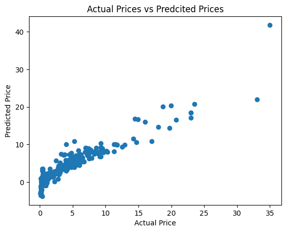
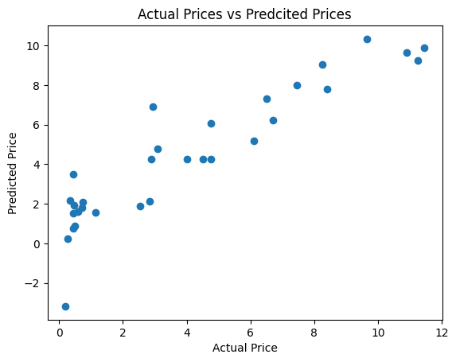
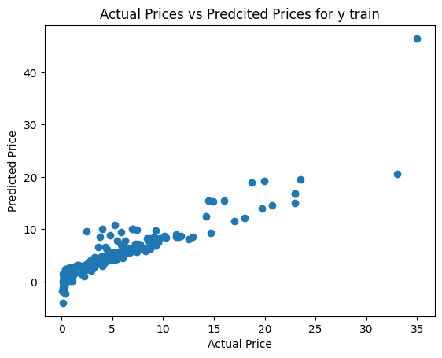
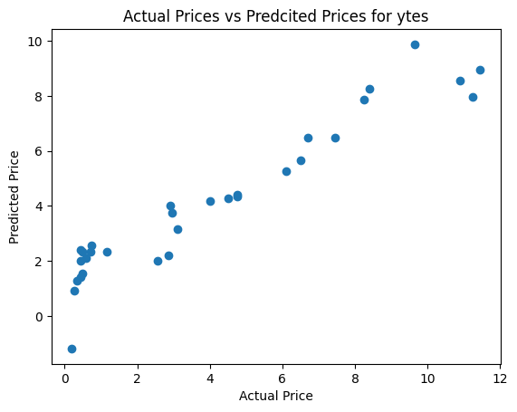

# Car Price Prediction Project

This [project](https://github.com/nasim-raj-laskar/pyth-30/blob/main/Python%2030/Car-Price-Prediction/car-price-prediction.ipynb) predicts car prices using machine learning techniques. The [dataset](https://github.com/nasim-raj-laskar/pyth-30/blob/main/Python%2030/Car-Price-Prediction/car%20data.csv) contains details such as fuel type, seller type, transmission type, present price, and more. The models used include Linear Regression and Lasso Regression, evaluated based on R-squared error.

## Tools and Libraries
- **Python**
- **Pandas**
- **Matplotlib & Seaborn**
- **Scikit-learn**

## Outputs
### R-squared Error:
- **Linear Regression**:
  - Training Data: *87%*
  - Test Data: *83%*

- **Lasso Regression**:
  - Training Data: *84%*
  - Test Data: *87%*

### Visualizations:
#### 1. Linear Regression

  
  

#### 2. Lasso Regression

  
  

