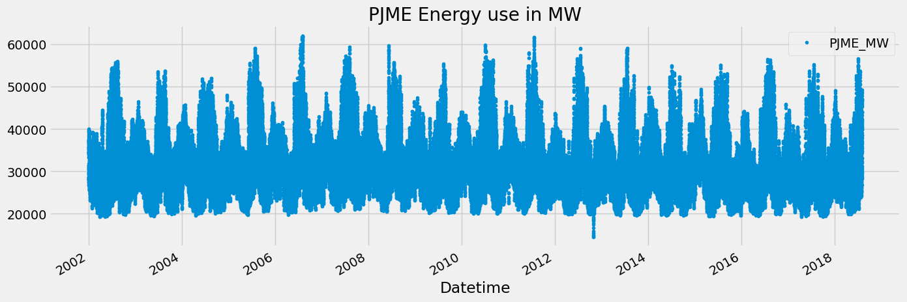
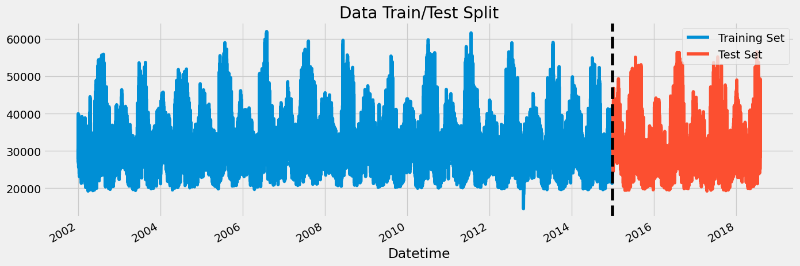
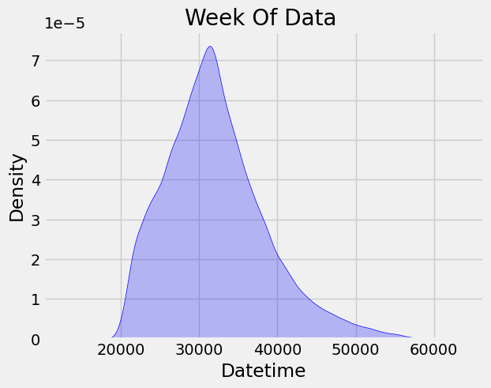
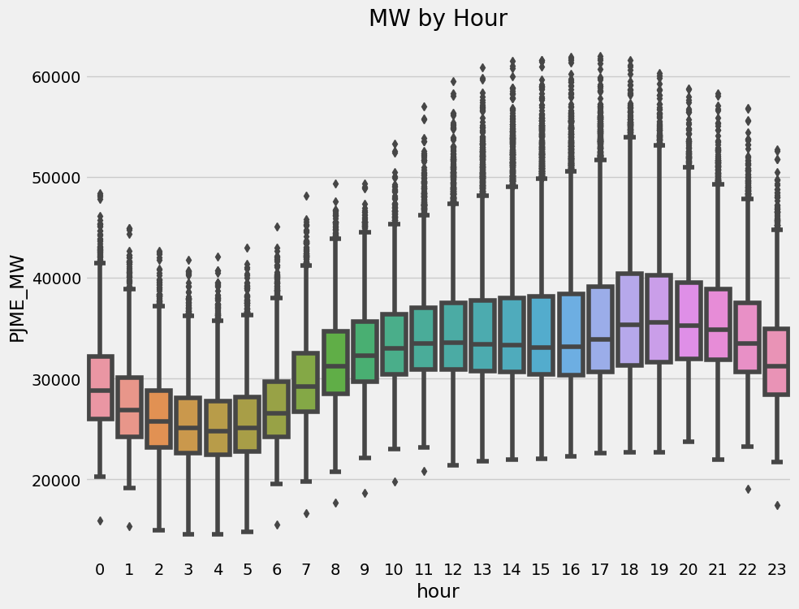
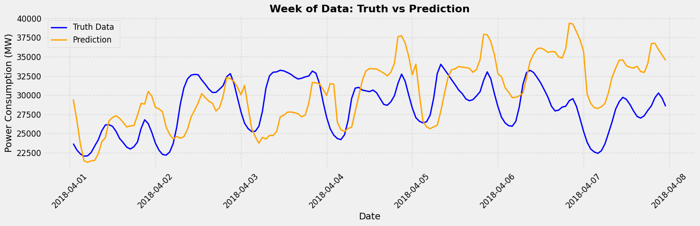
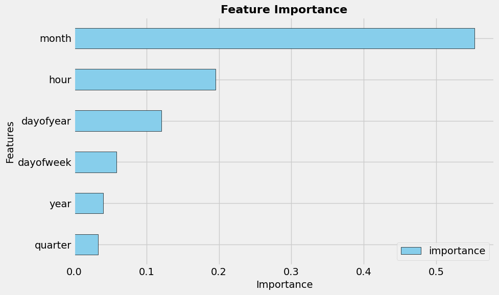
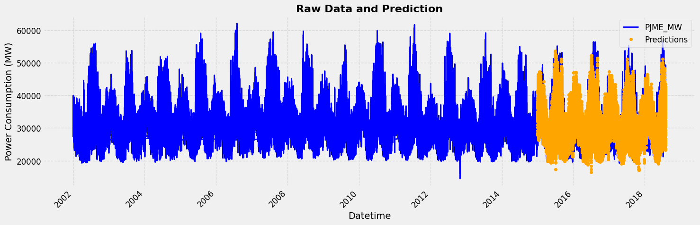
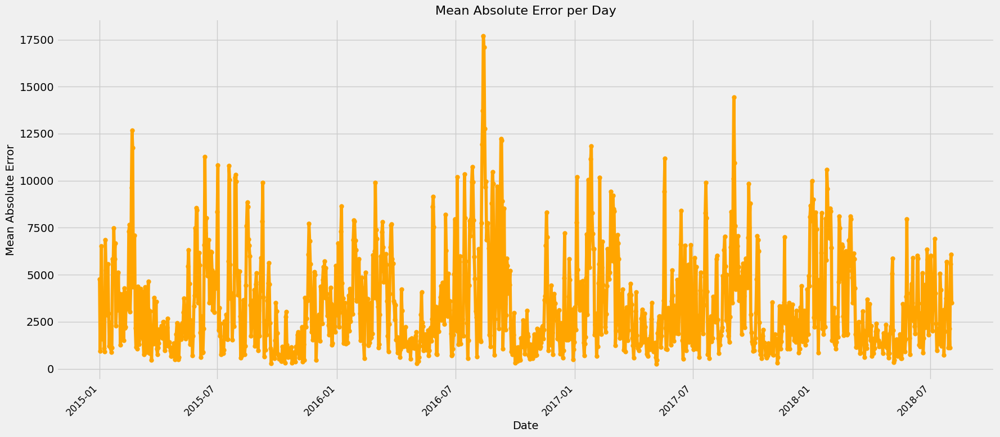

# Energy Consumption Prediction using XGBoost

This [project](https://github.com/nasim-raj-laskar/pyth-30/blob/main/Python%2030/Energy-Consumption-Forecasting/main.ipynb) predicts hourly energy consumption (in MW) for PJM (Pennsylvania, New Jersey, and Maryland) based on historical [data](https://github.com/nasim-raj-laskar/pyth-30/blob/main/Python%2030/Energy-Consumption-Forecasting/PJME_hourly.csv). The [dataset](https://github.com/nasim-raj-laskar/pyth-30/blob/main/Python%2030/Energy-Consumption-Forecasting/PJME_hourly.csv) contains energy usage information, and through data preprocessing, feature engineering, and model training, the project aims to accurately forecast future energy demand. The model was built using the XGBoost algorithm, which is effective for regression tasks due to its boosting capabilities. The model’s performance is evaluated using evaluation metrics and visualizations.

## Tools Used
- **Pandas:** For data manipulation and preprocessing.
- **NumPy:** For numerical operations and handling arrays.
- **Matplotlib & Seaborn:** For visualizing the dataset and model predictions.
- **XGBoost:** For building the prediction model using gradient boosting.
- **Scikit-learn:** For data splitting, model evaluation, and metric calculation.

## Visualizations

### 1. **Energy Consumption Time Series Plot**

This plot visualizes the energy consumption (`PJME_MW`) over time, showing how it fluctuates across hours, days, and months.

---

### 2. **Train/Test Data Split**

The plot below shows the split between the training and test data. The vertical black dashed line marks the cutoff date between the training and test sets.

---

### 3. **Distribution of Energy Consumption (KDE Plot)**

This KDE plot shows the distribution of energy consumption for a specific week of the data.

---

### 4. **Feature-Target Relationship**

These boxplots display the relationship between the `hour` and `month` features and the target variable `PJME_MW`. They help understand how energy consumption varies by time of day and month.

- **MW by Hour** and **MW by Month**

  
  

---

### 5. **Model Prediction vs Actual Energy Consumption**

This plot compares the predicted energy consumption with the actual values from the test set. The blue line represents actual data, while the orange line represents the predicted values.

---

### 6. **Feature Importance Plot**

This bar chart shows the importance of different features in predicting energy consumption. Features with higher importance contributed more to the model's decision-making process.

---

### 7. **Raw Data vs Predictions Plot**

The plot below compares the raw energy consumption data with the predictions made by the model.

---

### 8. **Mean Absolute Error per Day**

This line plot shows the mean absolute error (MAE) per day, highlighting the model's accuracy over time.

---

