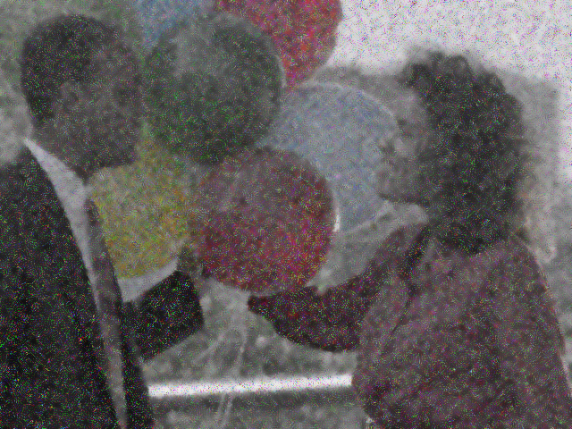
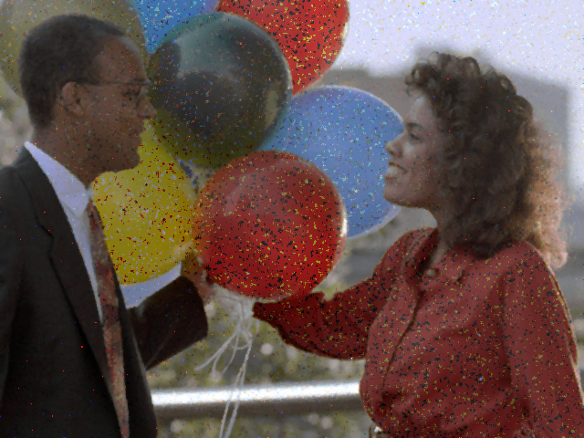
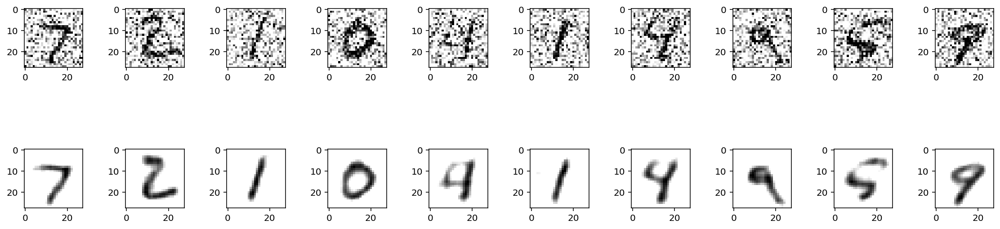

# Image Denoising Techniques

This repository covers two main sections of image denoising techniques:

1. [**Denoising Basic**](denoising-Basics): Four foundational projects demonstrating diverse denoising techniques for images.
2. [**Denoising on MNIST Dataset**](Denoising-on-mnist): An advanced approach using a deep learning autoencoder to denoise handwritten digits from the MNIST dataset.

---

## Section 1: Denoising Basic

This section contains fundamental implementations of various image denoising techniques. These methods help reduce noise in images and enhance visual clarity, often serving as preprocessing steps for further image analysis.

The folder includes four projects:

1. [**Gaussian Kernel**](denoising-Basics/Gaussian_kernel.py): Demonstrates the creation of a Gaussian kernel and its visualization.
2. [**OpenCV Detection**](denoising-Basics/opencv_denosing.py): Implements denoising techniques such as Gaussian Blur, Median Blur, and Bilateral Filter using OpenCV.
3. [**Image Denoising**](denoising-Basics/IMAGE_denoising.py): Utilizes `skimage.restoration` methods for non-local means denoising and applies Gaussian and Median filtering.
4. [**Edge Detection**](denoising-Basics/edges_detection.py): Applies the Canny edge detection algorithm to highlight edges in noisy images.

## Tools Used

#### 1. Gaussian Kernel

  - `numpy`
  - `matplotlib.pyplot`
  - `OpenCV`
  - `skimage.restoration`
  - `scipy.ndimage`
## Output Visualization

   

       
       
       
   

## Section 2: Denoising on MNIST Dataset

This project demonstrates the use of a convolutional autoencoder to denoise images from the MNIST dataset. It adds artificial noise to images and trains the model to reconstruct the clean versions.

### Tools Used

- `TensorFlow`/`Keras`: For constructing and training the autoencoder model.
- `NumPy`: For data manipulation and adding noise.
- `Matplotlib`: For visualizing noisy and denoised images.
- `Scikit-Image`:For advanced image denoising techniques.
- `SciPy`: For Gaussian and Median filtering operations.

---

1. **Noisy vs. Denoised Images**:
   - Displays side-by-side comparisons of noisy and denoised images from the test dataset.
     
---
